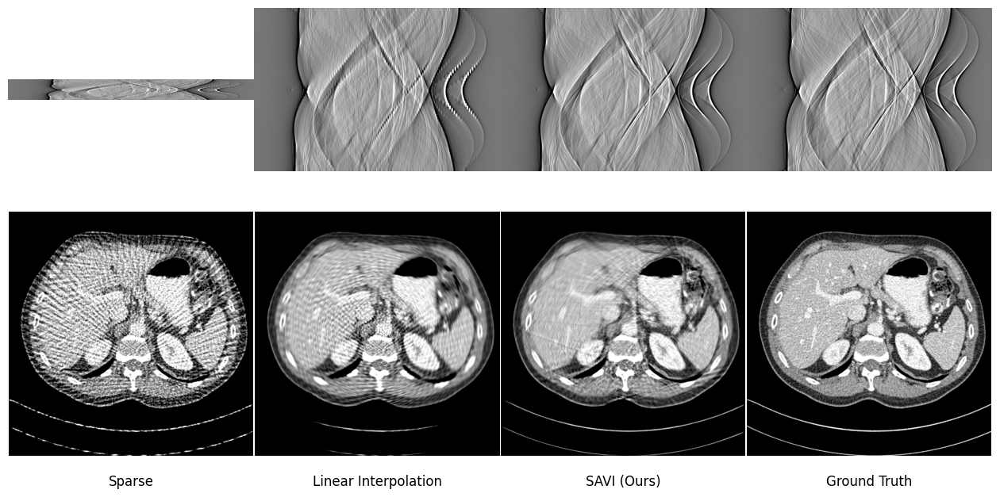

# Official Implementation for "SAVI: slope-aware sparse-view sinogram interpolation"

This project contains CT image reconstruction code utilizing Soft-DTW (Dynamic Time Warping) implemented using OpenAI Triton.

## Key Features
*   **Triton-based Acceleration**: Efficiently performs distance calculations and Soft-DTW operations on the GPU via `euclidean_dist_triton.py` and `soft_dtw_triton.py`.
*   **Sinogram Alignment & Reconstruction**: Uses Soft-DTW to align sinograms, leading to improved reconstruction results.

## Requirements
*   PyTorch (we conducted all experiments using version 2.7.0)
*   Triton (automatically installed when you install pytorch)
*   [LEAP](https://github.com/llnl/LEAP) (if using Projector)

## Usage
Just run the `DTW_demo_parallel.ipynb` notebook!!
Our approach does not require any training steps! (plug-and-playable)

## Acknowledgements
Our code uses LivermorE AI Projector for Computed Tomography (LEAP) framework to perform filtered back-projection (FBP) for reconstruction. 
We appreciate for their contributions to the CT imaging community! 
